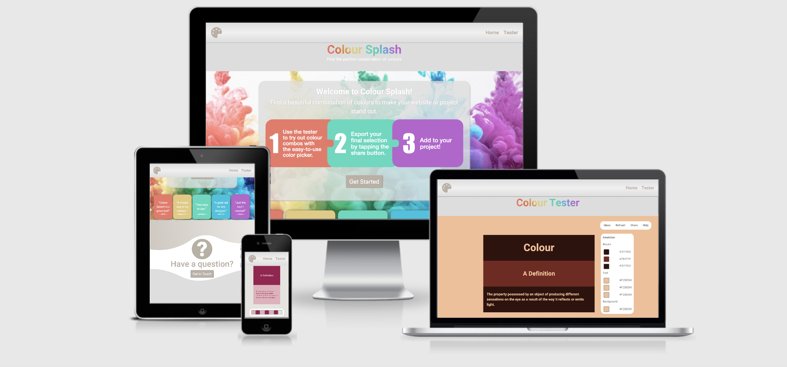

# Colour Splash - A Colour Combination Tester

The live website can be viewed on Github pages using this link: (https://daisybutler.github.io/colour-splash/)

Colour Splash is an easy-to-use website for trying out combinations of colours. A user can experiment by placing different colours together, including both background and text colours. They can also browse through suggested colour combinations. Selected colour combinations can be exported in text format for the user to replicate later in their own website or project. 

I wanted to create a simple, yet useful, interactive tool which is orientated around design. After functionality, a mordern and clean look to a website is a feature which really excites me. Similarly, from a user/consumer perspective, this is also a major contribution to a user's decision to visit, use, engage with and (if applicable) pay for/purchase from a website. Therefore, in the planning stages of this project, the aesthetic rendering of different features was paid close attention to.

## Table of Contents

1. [UX](#ux)
    * [Primary Goal](#primary-goal)
    * [User profile](#user-profile)
    * [User Stories](#user-stories)
    * [Design Process](#design-process)
        * [UX Research](#ux-research)
        * [UX Design](#ux-design)
        * [Colours](#colours)
        * [Fonts](#fonts)
    * [Wireframe Mockups](#wireframe-mockups)

2. [Features](#features)
    * [Home](#home)
    * [Tester](#tester)
    * [Interactive Features](#interactive-features)
    * [Features to Implement in the Future](#features-to-implement-in-the-future)

3. [Technologies Used](technologies-used)
    * [Languages](#languages)
    * [Tools](#tools)
    * [Libraries](#libraries)
    * [APIs](#apis)
    * [Graphics](#graphics)

4. [Testing](#testing)

5. [Deployment](#deployment)

6. [Credits](#credits)
    * [Inspiration](#inspiration)
    * [Media](#media)
    * [Code](#code)

## UX

### **Primary Goal**

The primary goal of the website is to offer a simple tool which users, from designers to amateurs, will return to every time they need to experiment with colours. They might even recommend the site to their friends or colleagues. From a profit point of view, a later version of the website could require a user to sign up and pay a small subscription fee to use the tool. Alternatively, a website with heavy traffic offers an optimal space for paid advertisements while keeping the tool free to access for the user.

### **User Profile**
**The ideal user for this website is:**

The ideal user for this site is a designer (websites, graphics) who will find this tool useful on a regular basis. However, its use can be extended to any project creater who needs a colour scheme.

**Users of this website are looking for:**

- A space to test out different combinations of colours;
- Inspiration/suggestions for attractive colour combinations;
- A simple and efficient way of selecting colour combinations.

**This website facilitates this for the user by providing:**

- Simple-to-use color picker buttons;
- Both background and text samples which can have their colour changed;
- Straightforward steps for use, including visual prompts, under the 'Help' control;
- A 'Share' option so users can save a text copy of their colour selection locally;
- Easy navigation - text is kept to a minimum, clear call to action, two-page website, clean layout.

### **User Stories**

1. As a new user, I want to find it easy to navigate the website and find the testing tool.
2. As a new user who is not a designer/developer, I want to find inspiration with attractive example colour combinations.
3. As a new user, I want to find instructions for using the website.
4. As an existing user, I want to export a text copy of my chosen colour combination to my device, so I can refer back to it after closing the Colour Splash website.
5. As an existing user, I want to be able to contact the owner of the site with a question about, or problem with, using the website.
6. As a new user, I want assurance that others recommend the use of this tool.
7. As an existing user, I want to be able to reset my colour selection and begin over.
8. As an existing user, I want to experiment with shades of colours, which update and display instantaneously for me to see.
9. As an existing user with a colour selection already in mind, I want to input a HEX or RGBA number directly into the colour picker.

### **Design Process**

#### UX Research

#### UX Design

1. Strategy Plane

In my research, I looked into other colour testing tools which were available online. I found that, while you could test three or four colours alongside each other, there was never really any option to change the entire background colour. I would argue this is a necessary feature to most accurately test a colour scheme before implementing it on a website. Similarly, very few sites gave the user the option to test diferent text colours on top of their samples. Again, for someone constructing a website which will undoubtedly contain text, this is a necessary feature to be able to test. Therefore, I identified the need for a colour testing tool which gives the user both the option to change the entire background colour and the colour of text on top of samples.

2. Scope Plane

Having decided what sort of colour testing tool there was a need for, I investigated the scope of such a project. The primary interactive feature necessary was clearly a colour picker tool. The Color Picker Library [(see Technologies Used)](#libraries) was the simplest, free way to implement this. The colour picker tools would have to have some visual demonstration for the user and I decided on simple blocks, with text contained within them, which would change colour immediately with the input in the colour pickers. It was also clear that some controls would be necessary for such a tool. I listed these controls as the basic functions 'Refresh' and 'Help', with the 'Share' and 'Ideas' options developing shortly after.

The suggestion of a Homepage came after the Tester page, since the website needed some sort of inticing and explanatory landing page. Therefore, the features decided on for the Homepage were a call to action, reviews of the tool displayed from previous users and a contact option for questions or general enquiries.

3. Structure Plane

Once I had decided on the features I wanted to include, I moved on to the structure. The website would be two seperate pages rather than one continuous page for the sake of user clarity on their location in the site. A fixed nabar would ensure that they always had access to navagation controls. The primary purpose of the Homepage would be to faciliate the entry of the user to the Tester page via the call to action button. The Tester page is the main reason for the user's visit, therefore its obvious location is paramount. 

4. Skeleton Plane

With the basic structure of the website in mind, I moved on to the skeleton of the website. My wireframes were built in Figma [(see wireframes)](#wireframe-mockups). The Homepage's primary purpose, as aforementioned, is to present an aesthetic landing page to the site visitor and present a direct path to the Tester page. Thus, the page would have a colourful title, and background image in the section immediately below, followed by a jumbotron containing simple instructions and a large call to action button labeled 'Get Started'. Should the user wish to find out a bit more before committing to checking out and using the colour tester tool, there would be reviews from previous users of the tool below. At the bottom of the page would be a contact section, with a collapsed contact form to reduce clutter on the page. The user can easily return back to the top of the page by clicking a 'back to top button' in the bottom right hand corner.

The Tester page would consist of one section. Three blocks containing three different sizes of text (main heading, sub-heading and paragraph) would be in the center. To the right of this would be seven swatches, stacked vertically and seven corresponding hex numbers stacked vertically. Each swatch and hex pair would correspond to one block, text or background colour. Clicking on each swatch would open up an interactive colour picker. The controls for the tool would be positioned in the top right hand corner, similar to the intuitive positioning of game controls. The 'Refresh' control would have a popup asking the user to confirm they wish to refresh, in case they inadvertently click it.

5. Surface Plane

The focus of the visual design of the Colour Splash website would be a sleek, simple and modern feel. All of the consistent site features such as the navbar and footer would be light grey with a taupe type colour (for contrast) on any text positioned over it. This simplistic design would ensure the aesthetic compatibility of the website with any input of colours the user might wish to combine i.e. there would be no colour clashes or distracting visuals.

The Homepage would have five bright colours featured for the purpose of presenting to the user the beauty and vibrance of colour. An uninspiring and boring landing page would not encourage the user to check out the website's tool. The colours, while bright, would not be too intense, and have a pastel vibe for a softer feel. 

I'm an advocated for rounded edged to all shapes on websites because I think it effortlessly gives a modern and sleek feel. Thus, all buttons and boxes would have a suitable border radius set, with the exception of the testing blocks in the tool because, for display purposes, crisp edges prove a better fit.

#### Colours
The Homepage is has the base colours as follows:
*  #FFFFFF (White) 
*  #BAB0A4 (Taupe) 
*  #DDDDDD (Grey) 

To illustrate to the user how bright, bold and beautiful combinations of colour can be, the page also showcases the following pastel shades:
*  #EF7566 (Pastel Red) 
*  #E4CA7C (Pastel Yellow) 
*  #46D9BD (Pastel Green) 
*  #00C2DE (Pastel Blue) 
*  #BD60CE (Pastel Purple) 

These shades were picked from the homepage's background image, to create visual consistency across for the page for an aesthetically pleasing effect. 

The base colours for the Tester page are as follows:
*  #FFFFFF (White) 
*  #BAB0A4 (Taupe) 
*  #DDDDDD (Grey) 
 
This neutral colour scheme ensures no colour clashes arise when the user changes the blocks, text or background colours in the testing area. Similarly, it ensures the user's input is not detracted from or skewed by the presence of 'loud' colours around the testing area. 

#### Fonts

The fonts used in this project are "Heebo" from Google fonts and Sans Serif. All text with the font-family "Heebo" have been assigned the fallback font Sans Serif should Google fonts fail to load.

The "Heebo" font was choosen for its legability and 'soft' look. Text needs to be read on a wide range of background colours, thus simplicity of font choice is paramount. 

### **Wireframe Mockups**

[**Home** - page 1](assets/images/readme-images/home-wireframe.png)

[**Tester** - page 2](/assets/images/readme-images/tester-wireframe.png)

The entire Figma workspace can be viewed [here.](https://www.figma.com/file/nElFkz4EXEIG4BUX7zjIgB/Milestone-2-Color-Splash?node-id=0%3A1)

## Features

Each page features a navigation bar where all the website's pages can be accessed and the conventional positioning of the website logo to the left-hand side.

Both pages' main titles have the CSS text gradient effect applied, which changes when the user hovers over them, to ensure a consistent theme across the website.

Both pages have a footer containing the website's logo in the center.

A favicon matching the website's logo is installed in the header of each page.

### **Home**

The homepage features a **jumbotron** with a box-shadow effect, which makes it appear to be 'floating' above the colourful **background image**. It contains: a bold **welcome message** stating the purpose of the site; an artistically-designed and simple **three step guide** to using the site; and a clear **call to action** button, which grows in size when hovered over to encourage clicking, prompting the user to visit the Tester page. 

On extra-small screens, the three steps image disappears from the jumbotron, and instead, the content appears in three blocks (one for each step) below it. This is because at smaller screen sizes, the text was too small to read in the image. The blocks' background colours on extra-small screens are the same as those on larger screens to maintain visual consistency. The back to top button also no longer displays because it is a feature only really useful on larger screens.

The **review boxes** which appear below the jumbotron and homepage background image serve as a further prompt to the user to go and try out the tester tool if they have not yet clicked the call to action button. Each review box has a background colour which blends with the colour scheme of the homepage background image above, which is both visually-appealing and signifies the website is passionate about beautiful colour combinations. The inference is that it can help the user find beautiful colours for their website too. 

On medium screens, the two reviews on the left and right disappear to avoid a 'cluttered' look and to ensure the remaining reviews match the visible colours on the background image above. On small screens, the reviews disappear completely due to significantly less space. 

The last feature on the homepage is the **contact section.** The large rhetorical question draws the user to the section and the question mark image visually reinforces the purpose of the section. 

On clicking the button below, a **contact form** contained in a modal drops down and the user can submit a question through the EmailJS API. 

A green **success message** appears underneath the submit button if the message has been successfully sent and the input fields are cleared.

Similarly, a red **fail message** appears if it has not and requests that the user tries again later. The contact section has its content justified in the center, with each element stacked over each other for a clean layout. The background space is filled with a subtle, neutral image for an visually-pleasing use of the free space.

### **Tester**

The tester page contains the **colour tester tool.** The tool had **four controls,** 'Ideas', 'Refresh', 'Share' and 'Help', intuitively placed in the top right-hand corner to replicate the conventional positioning of game controls. On hover, the background of each control becomes grey and the text becomes white. 

The **'Refresh'** **control** reloads the page so that the current colour selections made by the user are removed and the page becomes a fresh palette. Since the user may click this by accident and risk losing a colour selection, a **warning modal** pops up asking the user to confirm or cancel the refresh. There is intuitive colour coding for 'cancel' as red and 'yes, refresh' as green.

The **'Share'** **control** allows the user to export their current colour selection in text format to save on their device and refer back to after they have exited the site. The download will appear on the user's device as 'colour-combination.txt'. The image below shows where this download appears in Chrome.

The **'Help'** **control** is linked to a **help modal** which pops up with **detailed instructions** as to how to use the tool, should they not figure it out intuitively (perhaps less tech savvy people). The instructions are broken down in to **3 steps** to make it simple and easy to remember. **'Swatch' and 'color-picker' images** have been added after each reference since one test user for the developing website did not understand what these terms referred to. The modal can be easily closed using the **green 'Got it!' button.**

In the center of the tool, there are **three blocks** stacked on top of each other and each contains **three text samples** (either a suitably-sized heading, sub-heading or paragraph text). These text samples are the dictionary definition of "colour", rather than *lorem ipsum* or a generic 'heading', 'sub-heading' etc., to provide a more interesting, and on theme, text sample for the user to work with. The **entire background** of the tool is a sample that can be changed too. 

The block samples, before user interaction, **begin as either red, green or purple.** Originally, they were a light grey to suggest a 'blank workspace' feel, however test users suggested a clearer relationship between the block and its swatch could be seen if there was a colour relationship between them. White text goes with all three of these and the background also begins with this neutral tone.

To the right hand side of the blocks are **seven swatches** which each correspond to a block, text or background colour. There is a **'Swatches' label** and **sub-section label** above them for user clarity. On click, each swatch opens up a **color-picker,** where the user can browse colours with **a slider** or **directly input** a HEX, RGBA et al. The corresponding sample changes colour as soon so the colour-picker slider changes, allowing the user to instantaneously review their current selection. If the user is happy with their new selection, they can click the **'Save' button** and it will be saved to the swatch. If they wish to return to their **previous selection,** they can select this by clicking it in the top left-hand corner.

On larger screens the **hex number** of the current colour selection appears to the right-hand side of each swatch. This is a helpful feature for a designer since, as only one color-picker can be open at a time, they may wish to replicate a colour in another sample on the page. On smaller screens there is not sufficient space for these hex numbers, so they disappear. The user can still access all colour numbers in each individual color-picker.

The tool is **fully responsive** on all screen sizes, with all text sizes and block dimensions adjusting appropriately.

### **Interactive Features**

- **Responsive Headings:** The rainbow gradient effect on the background of the main heading on each page responds to the user hovering over it by transitioning to the red shade only. Hovering off again transitions the colours back to the rainbow effect.

- **Call to action buttons**: The two buttons on the homepage, 'Get Started' and 'Get in Touch' grow in size when the user hovers over them to prompt clicking.

- **Contact Form:** The 'Get in Touch' button on the home page triggers a modal to open on the left-hand side of the screen. Providing all required fields have been filled out, pressing the 'Submit' button will trigger the sendMail() function in the Javascript file sendQuestion.js.

- **Ideas:** The 'Ideas' control triggers the testing area to change all of its colours to a preset colour combination. There are 13 suggested combinations before the original default colours display again.

- **Refresh:** The 'Refresh' control triggers a warning modal. Clicking 'Yes, refresh' in this modal resets the page and thus the tester tool for the user.

- **Share:** The 'Share' control allows the user to download the hex numbers of their current colour selection. Clicking the button triggers the exportSelection() function found in exportSelection.js.

- **Help Modal:** The 'Help' control on the tester page triggers a modal to drop down from the top of the page, which the user can dismiss by clicking the 'Got it!' button.

- **Color-pickers:** The color pickers' expansions are triggered when the user clicks on the corresponding swatch. The user can input a color reference in the color picker by selecting a type along the bottom (e.g. hex) and inserting the reference in the bottom left-hand box, changing the corresponding sample colour on the screen. Alternatively, they can drag the color picker around the palette in the center, click a sample colour positioned along the bottom, and adjust the opacity on the right-hand side slider if they do not have an exact colour in mind. Colour changes happen simultaneously to the user's interaction with the color pickers. If the user clicks 'Save' in the bottom right-hand corner, the current current selection will become the new colour selection stored in the swatch. There are seven different color pickers, thus the user can input up to seven different colours on the page at once.

### **Features to Implement in the Future**

- Users might benefit from being able to input their own custom text to test their colour selections with, or manipulate the sizes of, the blocks. This would allow the user to mimic more closely their own project or website for a more accurate colour testing experience - it was a matter of time restraint in implementing this feature at this stage.

- The option to sign up for a Colour Splash account could prove of benefit for the user, where they would be able to save colour combinations to their account. In my opinion, this first version of the site is too simple to warrant a user creating an account to use the tool. However, should features such as saving colour selections to an account be implemented, it would be worthwhile.

## Technologies Used

### **Languages**

- HTML - base language for this project.
- CSS - used for styling the HTML code.
- JavaScript - used to make the website interactive.

### **Tools**

- [**Gitpod**](https://www.gitpod.io/) - the IDE Gitpod was used in the building process of this website.
- [**HTML Validation**](https://validator.w3.org/) - HTML was validated using W3C Validator.
- [**CSS Validation**](https://jigsaw.w3.org/css-validator/) - CSS was validated using W3C CSS Validator.
- [**JSHint**](https://jshint.com/) - Javascript was validated using JSHint.
- [**Free Formatter**](https://www.freeformatter.com/) - Free Formatter was used to format all HTML, CSS and Javascript files.
- [**Google Chrome DevTools**](https://developers.google.com/web/tools/chrome-devtools) - DevTools were used to debug and test code in the browser.

### **Libraries**

- [**BootstrapCDN**](https://www.bootstrapcdn.com/) - this project uses Bootstrap4 to make a fully responsive website and optimise its layout and structure.
- [**FontAwesome**](https://fontawesome.com/) - this project uses FontAwesome 5 to provide the icon used as the website's logo.
- [**Google Fonts**](https://fonts.google.com/) - this project uses Google Fonts to style the website's fonts.
- [**Color-Picker Library**](https://github.com/Simonwep/pickr) - this project uses the Color-Picker public library by Simonwep on Github.
- [**FileSaver Library**](https://github.com/eligrey/FileSaver.js) - this project uses the public library FileSaver.js by Eli Grey on Github.

### **APIs**

- [**EmailJS**](https://www.emailjs.com/) - this project uses the EmailJS API to facilitate email communication between users and the website owner. The email form is located in the dropdown modal in the contact section of the homepage.

### **Graphics**

- [**Keynote - Apple (UK)**](https://www.apple.com/uk/keynote/) - this project used Keynote to create the three-steps-image.png used on the homepage.
- [**Adobe Photoshop 2020**](https://www.adobe.com/uk/products/photoshop.html?sdid=88X75SKR&mv=search&ef_id=Cj0KCQiAqdP9BRDVARIsAGSZ8Ak7I5GPFqK_hyGJJ9M9rpFhX_cfOAqTWV44cFbDwwbIFny_prib-K0aAvzrEALw_wcB:G:s&s_kwcid=AL!3085!3!428621692972!e!!g!!adobe%20photoshop!9753976727!99414617483&gclid=Cj0KCQiAqdP9BRDVARIsAGSZ8Ak7I5GPFqK_hyGJJ9M9rpFhX_cfOAqTWV44cFbDwwbIFny_prib-K0aAvzrEALw_wcB) - this project used Adobe Photoshop to edit the project's graphics and the favicon image.
- [**Figma**](https://www.figma.com/) - this project used Figma to construct wireframes in the design stage of the website.
- [**Canva**](https://www.canva.com/) - this project used Canva to make the contact-background.png image.
- [**Unsplash**](https://unsplash.com/) - any photos used in this project were obtained from Unsplash.

## Testing

Testing information can be found in this [TESTING.md file](TESTING.md).

## Deployment

STILL TO COMPLETE.

## Credits

### **Inspiration**

- The 'Ideas' control for the tester displays colour schemes inspired by [Visme's blog post on colour schemes](https://visme.co/blog/website-color-schemes/).

### **Media**

- The background image colour-splash-background.jpg was taken by Paweł Czerwiński and was obtained from [Unsplash](https://unsplash.com/photos/3k9PGKWt7ik).
- The ms2-favicon is an edited version of the [FontAwesome palette icon](https://fontawesome.com/icons/palette?style=solid).

### **Code**

- Positioning and translating the contents of review boxes on the homepage used the CSS suggestions found on [W3C](https://www.w3.org/Style/Examples/007/center.en.html#block).
- The CSS text gradient effect applied to the main headings was originally taken from [Sarah L. Fossheim](https://fossheim.io/writing/posts/css-text-gradient/) and edited for to suit this website's colour scheme.
- Preventing the #three-steps image on the homepage from being draggable or selectable uses the CSS found on [this Stackoverflow thread](https://stackoverflow.com/questions/12906789/preventing-an-image-from-being-draggable-or-selectable-without-using-js).
- The tester page uses the Color-Picker library by [Simonwep on Github](https://github.com/Simonwep/pickr) aid by the example code displayed there.
- The contact form on the homepage is facilitated by the [EmailJS API](https://www.emailjs.com/).
- The 'Share' control on the tester page uses the FileSaver.js library by [Eli Grey on Github](https://github.com/eligrey/FileSaver.js).
- The basic implementation of the FileSaver.js library relied on [this helpful YouTube tutorial](https://www.youtube.com/watch?v=kwfoEb0-DQI) but was adapted for use in this website.
