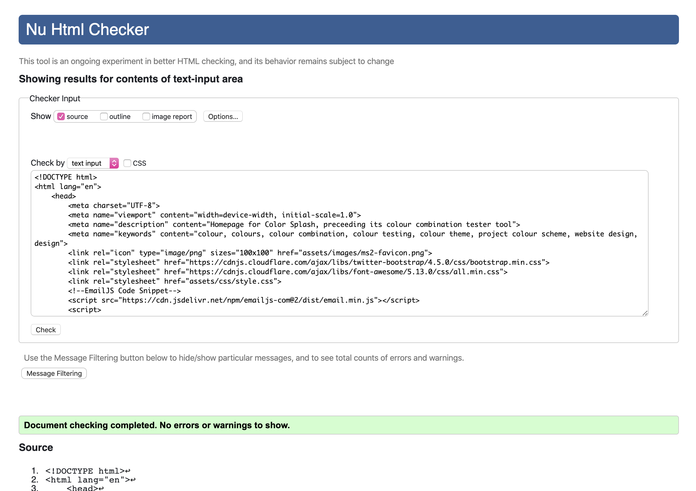
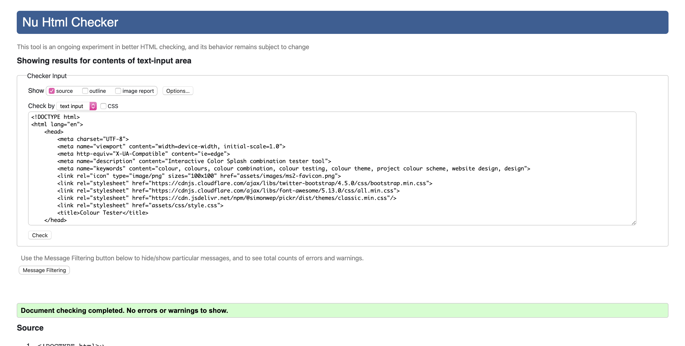
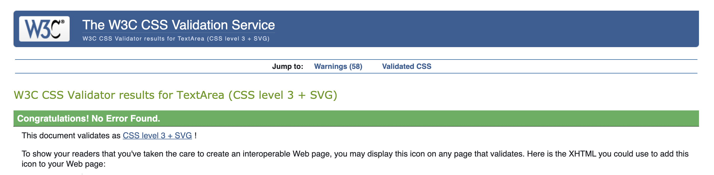
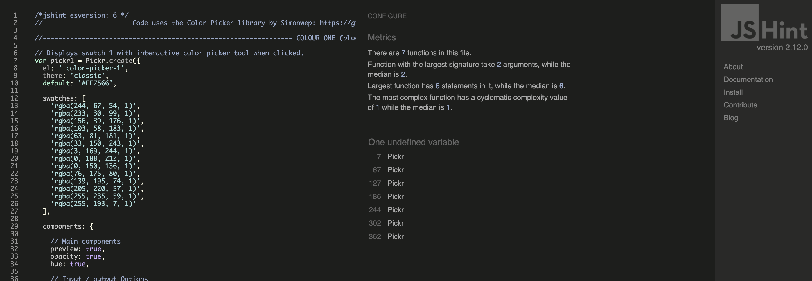
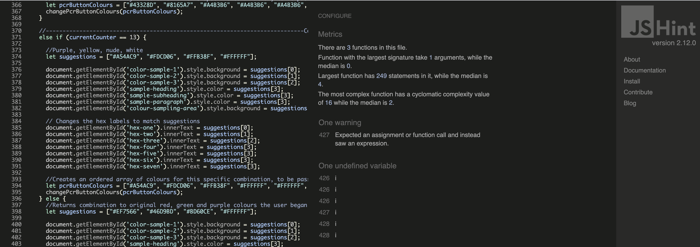
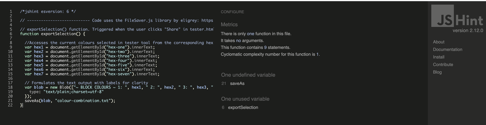
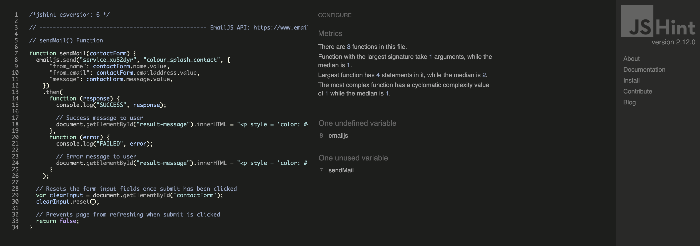

# Testing

[Back to README.md file](README.md)

## Table of Contents
---

1. [DevTools](#dev-tools)
    * [Responsiveness](#responsiveness)
    * [Console Debugging](#console-debugging)

2. [Manual Testing](#manual-testing)

3. [Automated Testing](#automated-testing)
    * [Code Validation](#code-validation)
    * [Browser Validation](#browser-validation)
    
4. [User Testing](#user-testing)
    * [Mentor Review](#mentor-review)
    * [User Review](#user-review)

## DevTools
---

By editing the HTML or CSS code displayed in DevTools, it could be established what changes were necessary to fix spacing/layout problems, without changing the actual files. Reloading DevTools and the original code in the browser is far easier then having to restore a file. 

### Responsiveness 
This Project uses Bootstrap and its grid system to ensure a responsive layout. This was tested in DevTools by viewing the website on every screen size, the smallest being an iPhone 5C and the largest being a laptop with HiDPI screen.

Multiple media queries for each Bootstrap cutoff point are set at the end of the style.css file to optimise layout and display on different screen widths.

All responses to screen size changes were suitable except on screen sizes below 442px. For this reason, media queries which did not target the conventional Bootstrap cutoff points were used to accommodate for tiny changes to layout/margins/padding on extra-small screens.

### Console Debugging
Viewing the console in DevTools was a useful way to debug this project's Javascript code: 
- The failure to load backToTopButton.js indicated the script tag for this file path had failed to be included at the bottom of the index.html. 
- By logging to console a message each time a Javascript function was or was not called, it could be identified whether a function was successfully working or whether it had an unidentified bug.

## Manual Testing
---

## Automated Testing
---

#### Code Validation

- This project used the [W3C Markup Validation Service]([https://validator.w3.org/](https://validator.w3.org/)) to validate html code.

    

    

- This project used the [W3C CSS Validation Service]([https://validator.w3.org/](https://validator.w3.org/)) to validate css code.

    

- This project used the [JSHint website]([https://jshint.com/](https://jshint.com/)) to validate Javascript code.

- This project used [Free Formatter]([https://www.freeformatter.com](https://www.freeformatter.com/)) to format HTML, CSS and Javascript code.

#### Browser Validation

### Mentor Review

Seun loved the aesthetic of the Homepage and the consistency in colours. She used the colour pickers on the Tester page easily and found all buttons to work as expected.

Seun made the following suggestions:

- Make the navbar fixed so that it was always accessible to the user on any scroll position.
- Add a "back to top" button to the Homepage, so that on a screen position of 300px or greater, a button appears in the bottom right hand corner. When the user clicks it, they are returned to the top of the Homepage.
- Make the swatches which toggle the colour pickers on Tester page display horizontally below the tester blocks on smaller screens. This way every feature in the testing are has sufficient room to be displayed and avoids being 'crammed in'.
- Make the swatches colours change to match the current colours displayed when the user clicks the 'Ideas' control on Tester page. This was something which this project had tried to implement in Javascript but to no avail. Seun helped with a solution to this.
- The contact form should drop down in the center of the page on larger screens as it already did on smaller screens.
- Include a Copyright clause in the footer of each page for a more professional finished look.

### User Review

This Colour Splash website was tested by friends and family. The overall feedback was very positive. In particular the 'Ideas" feature was greatly appreciated for those who did not consider themselves good at design and wanted inspiration. 

Suggested improvements were as follows:

- Within the 'Help' modal, less technologically savvy users did not understand the terms 'swatch' or 'colour picker', so an inclusion of visual examples of these features were included to aid understanding.
- Similarly, what each swatch corresponded to was not clear to first time users, thus the labels 'Swatches' and sub-labels 'Blocks', 'Text' and 'Background' were added for clarity. It was felt that the order of swatches (1-3) corresponding to the same order of blocks (1-3) and text (1-3) was intuitive, so there was no need to include more explicit labeling.
- Originally the sample block on the Tester page had margins between them. However, it was suggested that a better layout for colour comparison would be to remove these gaps so that the blocks fitted together.